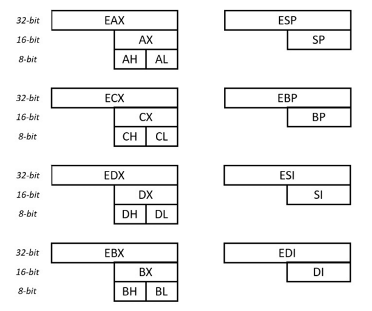
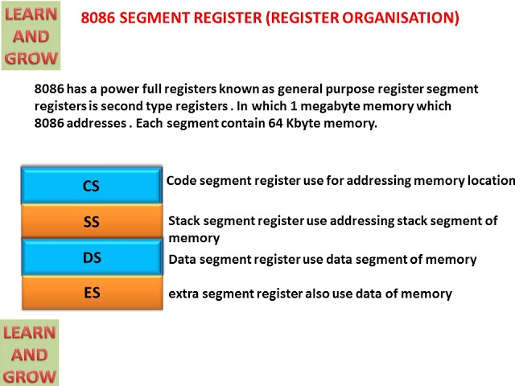
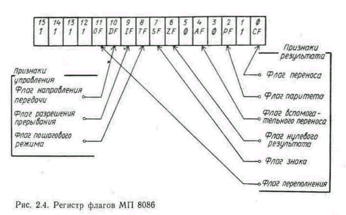

Первый микропроцессор создали intel в 1971 году, который работал с 4-х разрядными данными, в 1974 году - процессор 8080, работающий с восьмью разрядами и памятью до 64кб  
В 1976 году фирма Apple разработала первую персональную ЭВМ  
В 1978 году Intel разработали 16-ти разрядный 8086  
В 1981 году intel разработали свой первый ПК под названием IBM PC  
В 1983 году Intel разработали процессор 80286  
На его основе в 1984 году появился IBM PC AT. В нём теоретически уже мог использоваться многозадачный режим работы, однако мощности процессора было недостаточно  
Реально многозадачный режим работы появился вместе с 32-разрядными процессорами  
в 1987 году - i386, в 1988 - i486  
Эти процессоры работали в двух режимах - реальном (более быстрая версия 8086) и в защищённом режиме для реализации многозадачности  
В 1993 году появился 64-разрядный процессор Pentium  
Во всех микропроцессорах сохраняется преемственность, т.е. программа, написанная для младшей модели, может быть без изменений портирована на старшую  
Это обеспечивается тем, что в основе всех процессоров лежит система команд процессора 8086, в новые модели лишь добавляются новые команды, главным образом для обеспечения многозадачности  
Оперативная память делится на ячейки по 8 разрядов (байт). Разряды байта нумеруются справа налево  
Так как последовательность нулей и единиц бывает очень длинной, то содержимое ячеек принято записывать в 16-тиричной форме  
Байты нумеруются с нулевого, порядковый номер байта - адрес  
Объём оперативной памяти до $2^{20}$ байтов (1мб), поэтому для оперативной памяти нужны 20-разрядные адреса вида 00000h - FFFFFh  
Байт это наименьшая адресуемая ячейка памяти, однако есть ещё более крупные ячейки - слово, двойное слово и четверное слово  
Слово - два соседних байта, размер - 16 разрядов, справа налево от 0 до 15, адрес слова - адрес первого байта  
Четверное слово - 32 разряда, адрес - адрес первого байта  
![[Байты и слова.png]]
Байты используются для хранения небольших целых чисел и символов, слова для чисел, двойное слово для больших чисел и строк  
Для кратковременного хранения данных используют регистры - ячейки, расположенные в центральном процессоре и доступные из машинных программ  
Доступ к регистрам осуществляется намного быстрее, чем к ячейкам оперативной памяти. Все регистры имеют размер в одно слово, за каждым из них закреплено имя.  
По назначению и способу использования регистры делятся на уровни - регистры общего назначения, сегментные регистры, указатели команд и регистр флагов  
## Регистры общего назначения
https://metanit.com/assembler/tutorial/1.3.php

AX, CX, DX, BX устроены таким образом, что возможен независимый доступ к их старшим и младшим половинам  
Целиком регистры используются при работе с числами, а их половине - при работе с частями чисел и символами  
SI, DI, BP, SP предназначены для чтения и записи целиком  
Особенностью всех регистров общего назначения является то, что их можно использовать в любых арифметических, логических и других машинных операциях  
Если операнд берётся из памяти, то ссылаться на него можно указав некоторый адрес и некоторый регистр. В этом случае команда будет работать с так называемым исполнительным адресом, который вычисляется как сумма адреса, указанного в команде, и текущего значения указанного регистра. Этот процесс называется модификацией адреса, а используемый при этом регистр называется модификатором. Им могут быть только BX, BP, SI, DI. Модифицировать адрес можно и по двум регистрам сразу, но только так, что один из регистров - BX или BP, а другой - SI или DI  
## Сегментные регистры
Сегменты по 16 бит, не делятся  

В арифметических и логических операциях эти регистры не участвуют. Они участвуют в сегментировании адресов. Если в ЭВМ используется память большого объёма, для ссылок на её ячейки приходится использовать длинные адреса, а так как эти адреса указываются в командах, то и команды оказываются длинными. Сократить размеры команд можно путём сегменттрования.  
Любой адрес $A$ можно представить как $B+d$, где $B$ - начальный адрес сегмента памяти, где находится ячейка $A$, а $d$ - смещение  
Если сегменты памяти небольшие, то и смещение $d$ будет небольшим, поэтому б**о**льшая часть длинного адреса будет сосредоточена в $B$. Если команде необходимо указать адрес $A$, то тогда часть $B$ этого адреса записываем в определённый регистр и в команде вместо $A$ указываем этот регистр и смещение $d.$ Благодаря модификации адресов данная команда будет работать с адресом, равным сумме смещения $d$ и содержимого регистра. Размеры сегментов памяти не должны превышать 64кб, регистры - 16-битные адреса.    
В регистре CS находится начальный адрес сегмента команд. В регистре DS находится начальный адрес сегмента данных. SS - начало стека, тогда при ссылках на эти сегменты в командах соответствующие сегментные регистры не указываются, они подразумеваются по умолчанию.  
## Указатель команд
IP - \[d]  
В регистре IP всегда находится адрес команды, которая будет выполнена следующей, поэтому абсолютный адрес команды определяется как CS+IP  
Изменение любого из этих регистров это переход, поэтому содержимое CS, IP можно менять только командами перехода  
## Регистр флагов

Флаг - бит, принимающий значение 1, если выполнено некоторе условие, и 0, если условие не выполнено. В процессоре 8086 используется 9 флагов, собранных в 16-разрядный регистр Flags  
Флаги делсят на две группы:  
1. Флаги условий, которые автоматически меняются при выполнении команд и фиксируют те или иные свойства результата  
CF - для переноса арифметических операций  
OF - для арифметических операций над числами со знаком. OF = 1 - переполнение мантиссы  
ZF - 1, если результат равен нулю  
SF - 1, если в операции над знаковыми числами получился отрицательный результат  
PF - 1, если в восьми младших битах результата содержится чётное количество двоичных единиц (только IO)  
AF - особенности выполнения операций над двоично-десятичными числами  
2. Флаги состояний  
Эти флаги меняет сама программа, а их состояние оказывает влияние на дальнейшую работу процессора  
DF - устанавливает направление просмотра строк в строковых командах, 0 - LTR, 1 - RTL  
EF - При 0 процессор перестаёт реагировать на поступающие к нему прерывания  
TF - При 1 после выполнения каждой команды процессор делает прерывание, что используется для отладки  
# Представление данных и команд
В процессоре 8086 делается различие между целыми числами со знаком и без знака  
Целые числа без знака:  
Байт: 0 - 255  
Слово: 0 - 65535  
Двойное слоов: 0 - 4294967295  
Числа размером в слово или двойное слово хранятся в память в перевёрнутом виде. Это сделано для удобства сложения и вычитания. Однако числа размером в слово хранятся в нормальном виде  
Число 98 = 0062h  

Целые числа со знаком:  
Байт: -127 +127  
Слово: -32768 + 32767  
Двойное слово: -2 147 483 648 +2 147 483 647  
Знаковые числа записываются в дополнительном коде ($2^{k}-|X|$ при $X<0$)  
Символьные данные в ЭВМ хранятся в двоичном виде. Для этого каждому символу ставится в соответствие некоторое неотрицательное число, называемое кодом символа. Конкретное соответствие между символами и их кодами называется системой кодировки. В ЭВМ как правило используются восьмиразрядные коды символов, что позволяет закодировать 256 символов. Обычно для кодировки используется ASCII.  
Под каждую строку отводят нужное количество соседних байтов, которые записывают коды символов, образующих строку. Адресом строки считается адрес его первого байта